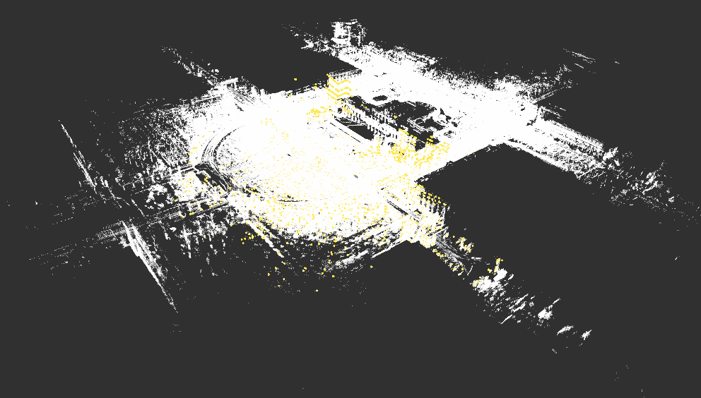

## A clean and simple NDT localizer

This repo modified from Autoware lidar_localizer module. Unlike the module in Autoware with haveily dependency on a lot of packages(you need compile all the packages in Autoware project), this repo is clean, simple and with no dependencies. All you need is ROS, and a pcd file(the point cloud map). 

Let's start our lidar-based localization learning with this simple repo!


## Localization in a pointcloud map(pcd)

From topdown prespective:


From tracking prespective:


### A demo video on zhulou-rs80 dataset:

From topdown prespective:
[](https://youtu.be/Dl07SZaVY7M)

From tracking prespective:
[](https://youtu.be/3wUi3WNgp94)

## How to use

### Prepare you pcd map and rosbag

Our pcd and rosbag are generated and recorded on Tsinghua campus. Please prepare your own pcd map and rosbag.

Put the pcd data to the map folder:

```bash
cp 12-31-zhulou-rs80.pcd map/
```

### Build in your ros workspace
clone this repo in your `ros workspace/src/`, and then `catkin_make` (or `catkin build`):
```bash
cd catkin_ws/src/
git clone https://github.com/AbangLZU/ndt_localizer.git
cd ..
catkin_make
```

### Setup configuration

#### Config map loader
Move your map pcd file (.pcd) to the map folder inside this project (`ndt_localizer/map`), change the pcd_path in `map_loader.launch` to you pcd path, for example:

```xml
<arg name="pcd_path"  default="$(find ndt_localizer)/map/12-31-zhulou-rs80.pcd"/>
```
#### Config point cloud downsample

Config your Lidar point cloud topic in `launch/points_downsample.launch`:

```xml
<arg name="points_topic" default="/rslidar_points" />
```

If your Lidar data is sparse (like VLP-16), you need to config smaller `leaf_size` in `launch/points_downsample.launch` like `2.0`. If your lidar point cloud is dense (VLP-32, Hesai Pander40P, HDL-64 ect.), keep `leaf_size` as `3.0`。

#### Config static tf

There are two static transform in this project: `base_link_to_localizer` and `world_to_map`，replace the `ouster` with your lidar frame id if you are using a different lidar:

```xml
<node pkg="tf2_ros" type="static_transform_publisher" name="base_link_to_localizer" args="0 0 1.9 3.1415926 0 0 base_link rslidar"/>
```

#### Config ndt localizer
You can config NDT params in `ndt_localizer.launch`. Tha main params of NDT algorithm is:

```xml
<arg name="trans_epsilon" default="0.05" doc="The maximum difference between two consecutive transformations in order to consider convergence" />
<arg name="step_size" default="0.1" doc="The newton line search maximum step length" />
<arg name="resolution" default="2.0" doc="The ND voxel grid resolution" />
<arg name="max_iterations" default="30.0" doc="The number of iterations required to calculate alignment" />
<arg name="converged_param_transform_probability" default="3.0" doc="" />
```

These default params work nice with 64 and 32 lidar.

### Run the localizer
Once you get your pcd map and configuration ready, run the localizer with:


```bash
# open a roscore
roscore
# in other terminal
cd catkin_ws
source devel/setup.bash
# use rosbag sim time if you are playing a rosbag!!!
rosparam set use_sim_time true
# launch the ndt_localizer node
roslaunch ndt_localizer ndt_localizer.launch
```

wait a few seconds for loading map, then you can see your pcd map in rviz like this:



give a init pose of current vehicle with 2D Pose Estimate in the rviz:


This operation will send a init pose to topic `/initialpose`.

play the rosbag:

```bash
rosbag play KAIST02-small.bag --clock
```

Then you will see the localization result:


